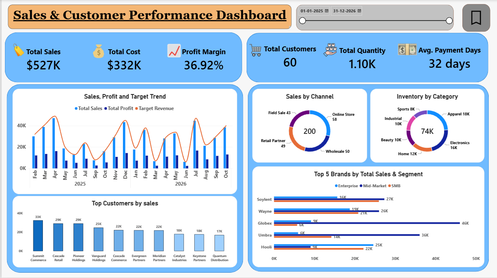
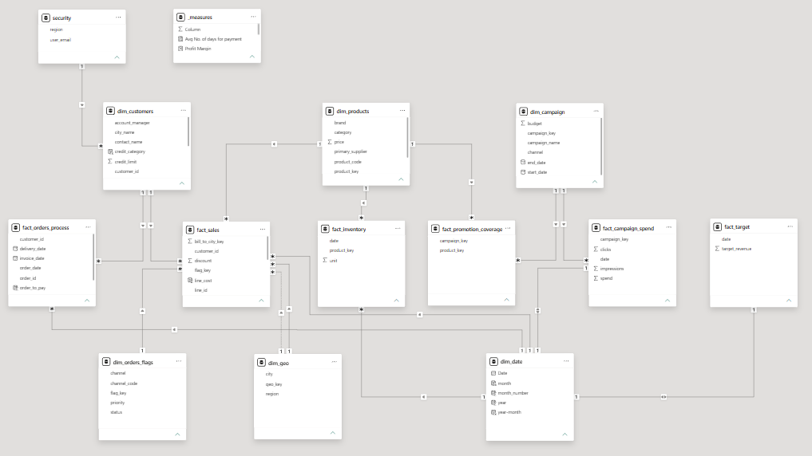

# Sales Analytics Dashboard

## Project Overview
An interactive sales analytics dashboard built using Power BI.

## Tools Used
- Power BI
- Excel
- DAX
- Power Query

## Dashboard Features
- Sales analysis
- Customer analysis
- Product performance
- Segment analysis
- Profit analysis
- Target analysis

## Key Skills Demonstrated
- Data cleaning
- Data transformation
- Data modeling
- DAX
- Data visualization
- KPI development

## Power BI Preview

